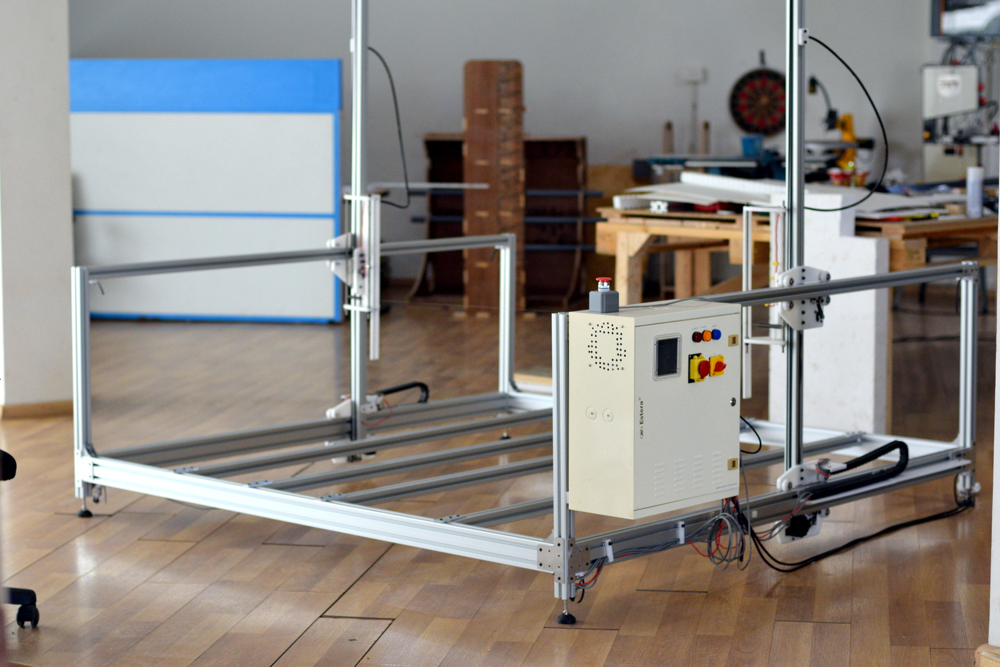
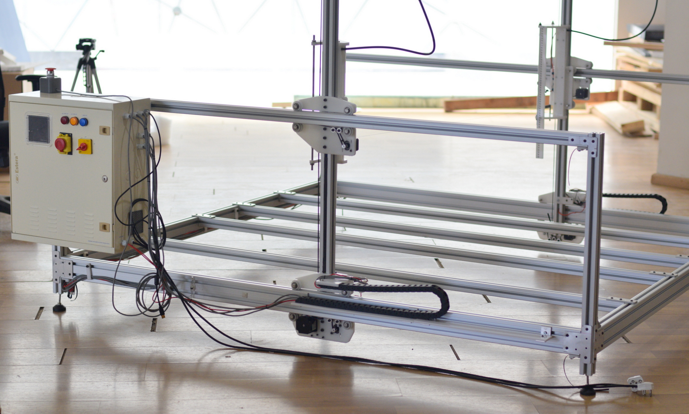
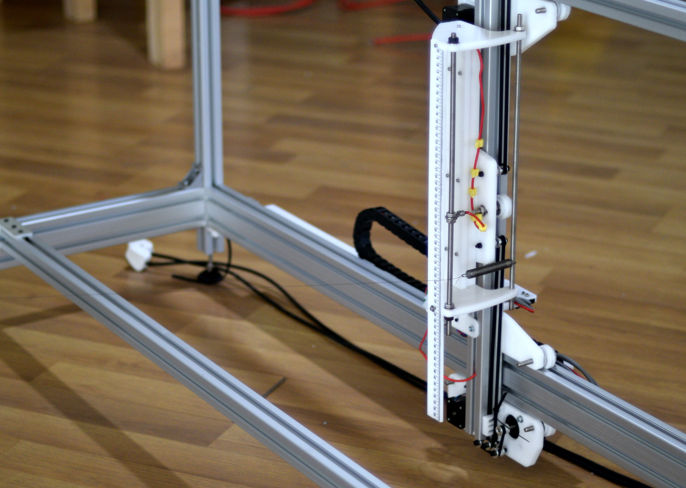
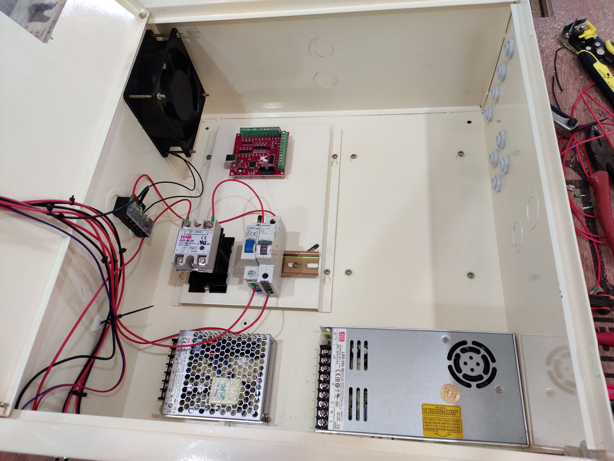
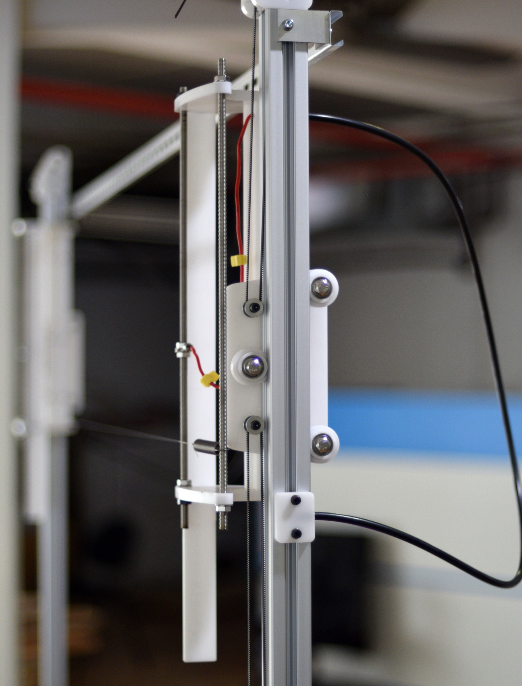

# CNC-Foamcutter
An Industrial CNC Foam cutter

First version using Arduino and Ramps

[https://github.com/rahulsarchive/4AxisFoamCutter](https://github.com/rahulsarchive/4AxisFoamCutter)

## 1. Control Box

