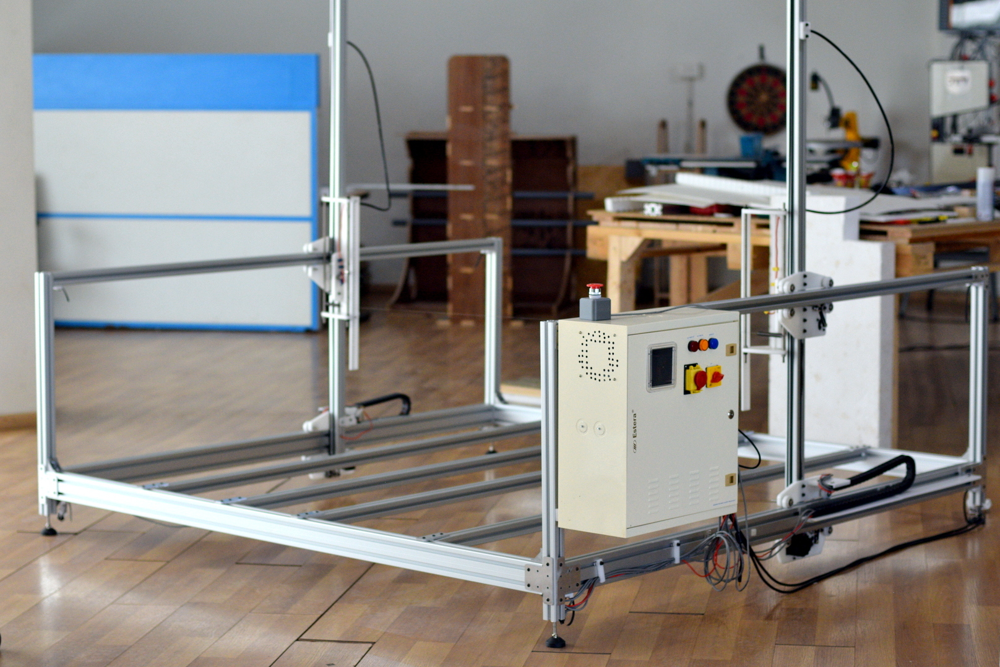
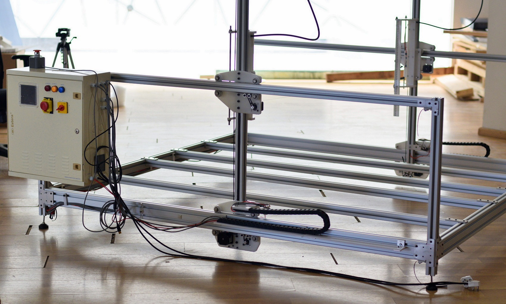
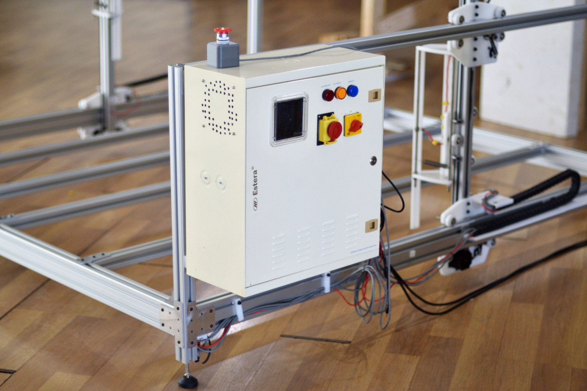
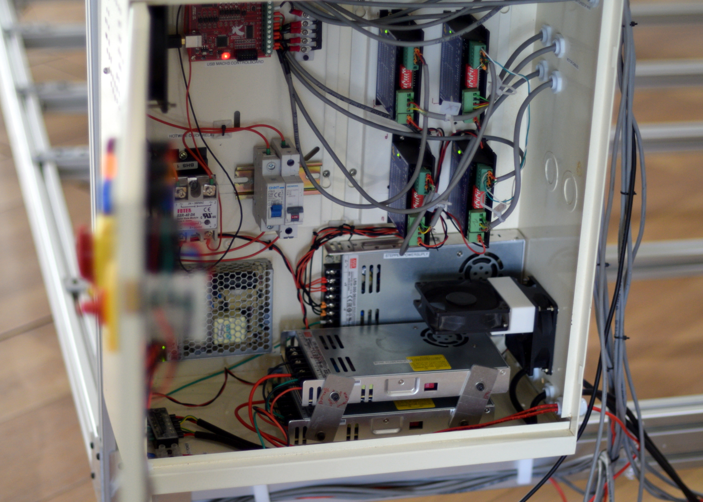
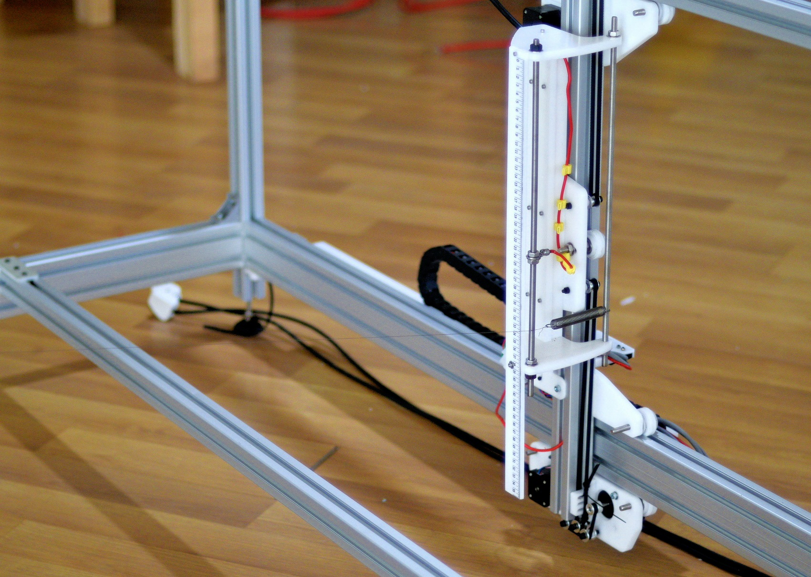
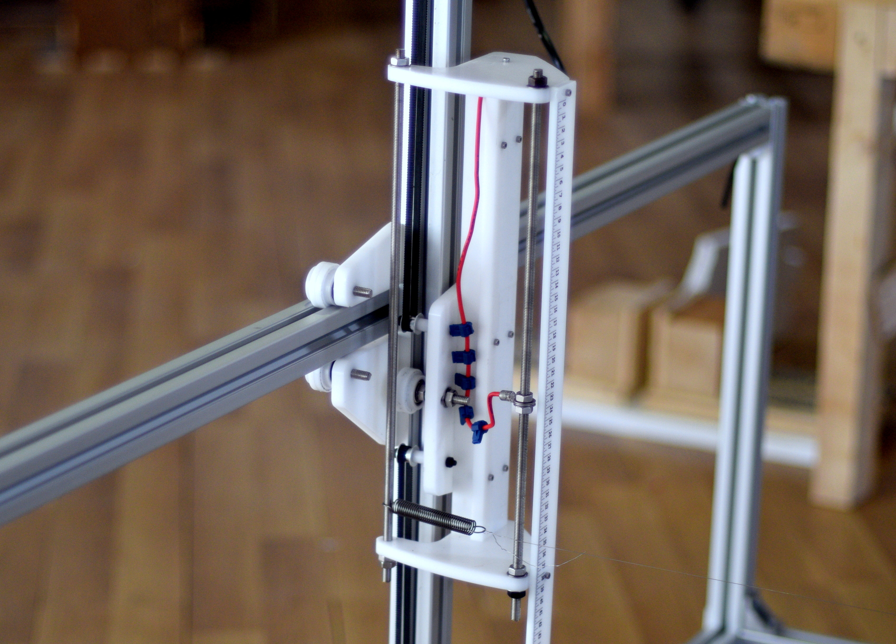
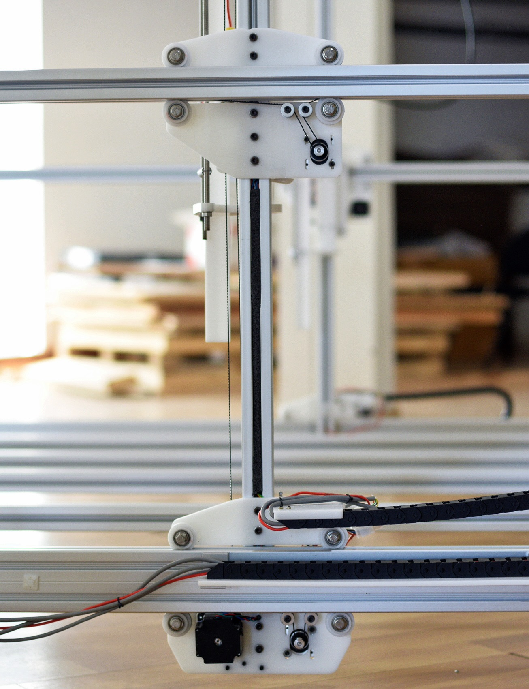
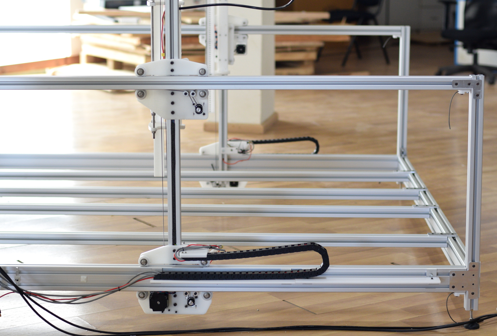
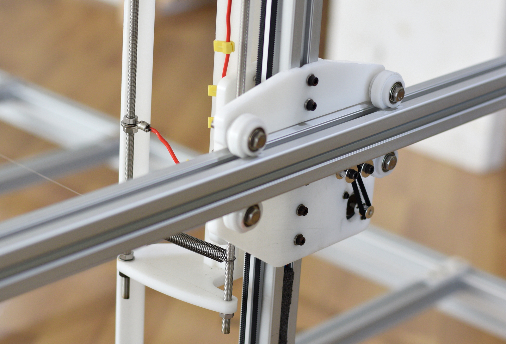
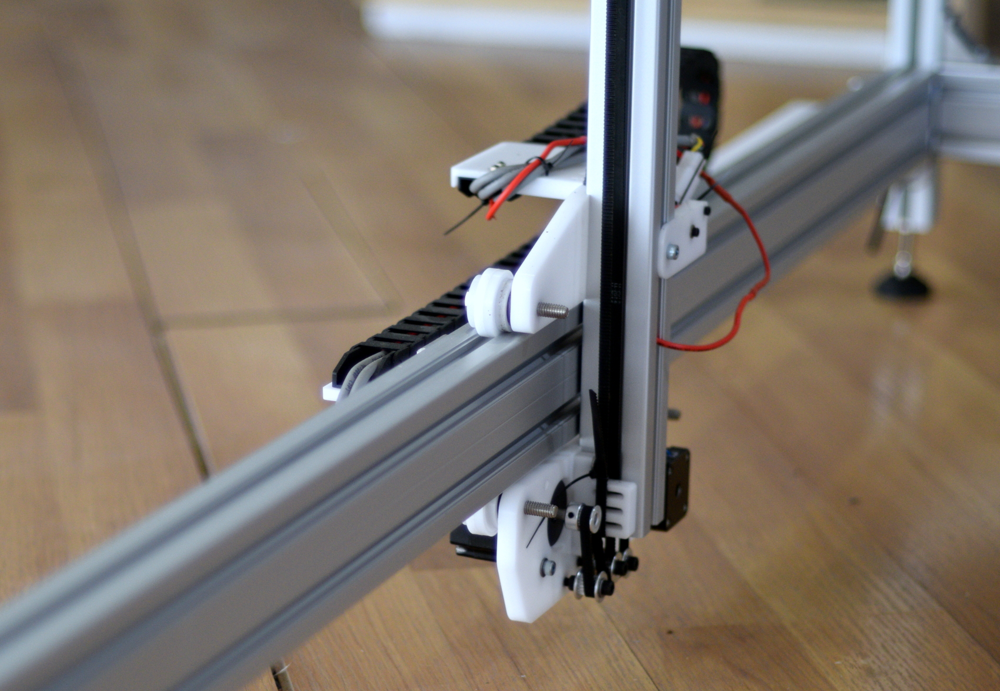

# DIY-CNC-Foamcutter

A DIY Industrial CNC Foam cutter.

### Specifications

1. Work Area - 1.6 x 1.6 x 1.5m
2. Power - 220v 6A
3. Heating Element - 26AWG Nichrome wire
4. Heating output - Meanwell DC 52V 700W
5. Max Cutting Feedrate - 2000mm/min
6. Controller - Mach3 USB
7. Stepper Drivers - Rhino Motion Controls
8. Max Paralel lines - 5 Nos

First version using Arduino and Ramps

[4-Axis Foam cutter(Arduiono +Ramps)](https://github.com/rahulsarchive/4AxisFoamCutter)

The frame made from 4040 Extruded Aluminum profiles and joined together with custom Aluminum brackets for rigidity.

Control box securely mounted on the side of the machine.

Original Meanwell powersupplies and Rhino Motion control Drivers.

Y carriage CNC machined from 10mm Delrin.

The nichorome wire is held in the carriage with spring on either side. Power to the wire is fed via the stainless steel threded rods which also act as vertical spacers between parallel wires.

The carriage runs on roller bearings with custom Delrin bushings which attach to the aluminum profiles. All the wire are contained in the frame itself and the design are modular.

The x-axis consits of two motors on each side, one on top and bottom to provide longitudinal stability. These are Nema 17 and they run on belts on either side.

The Y-axis holds a Nema 23 motor with the belt running through the inner profile of the Aluminum extusions. The wires from the control box are fed via a cable carrier.

